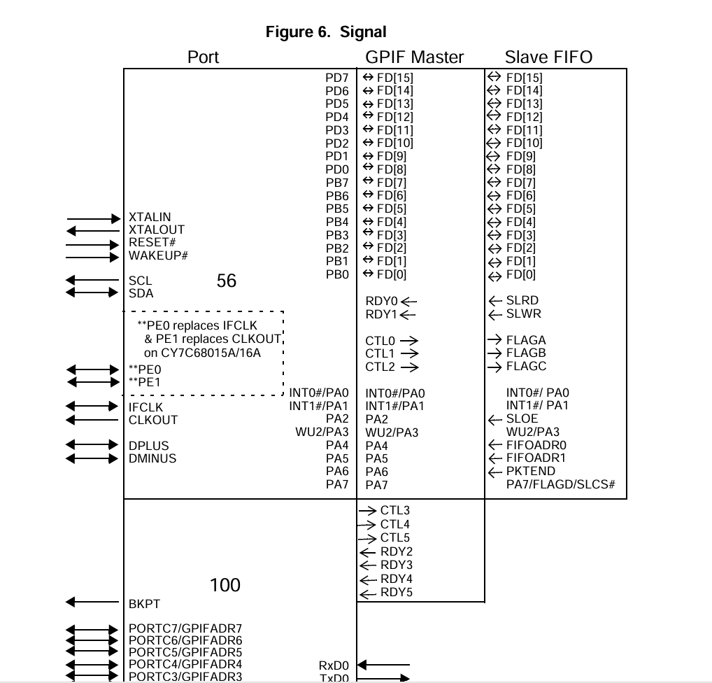
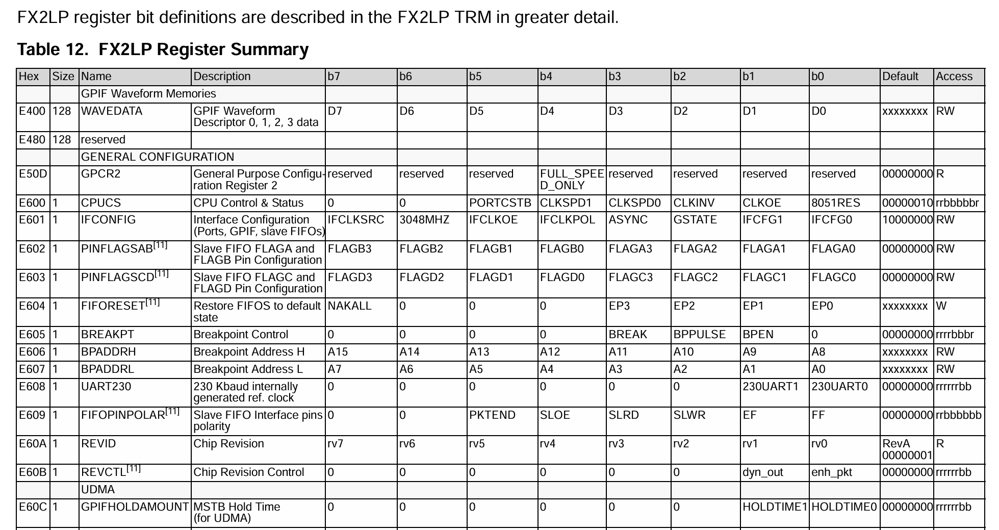
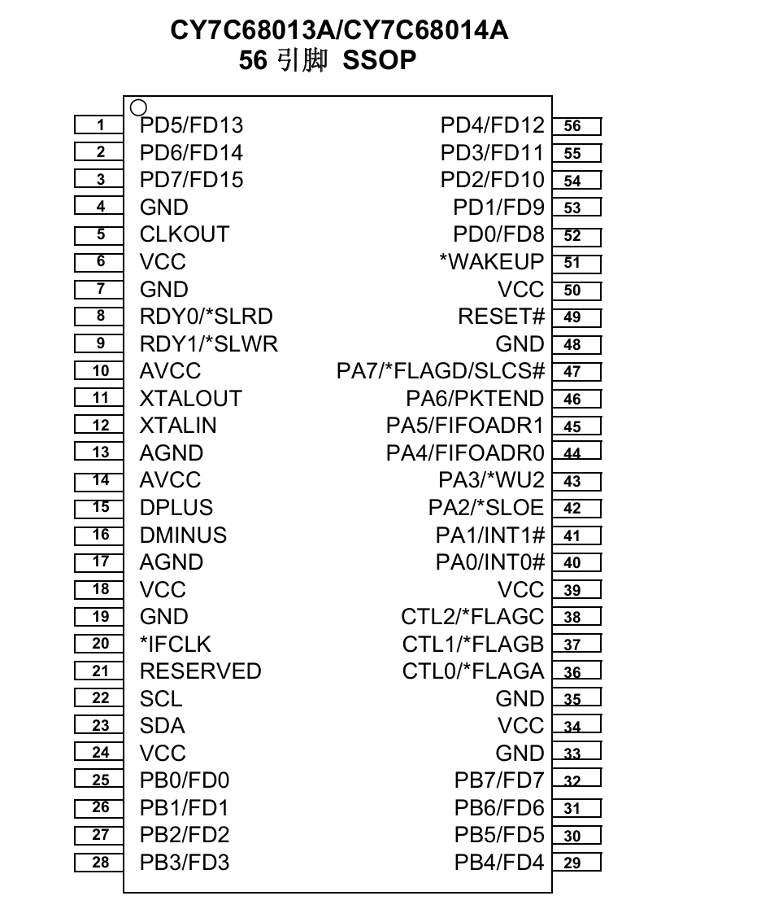
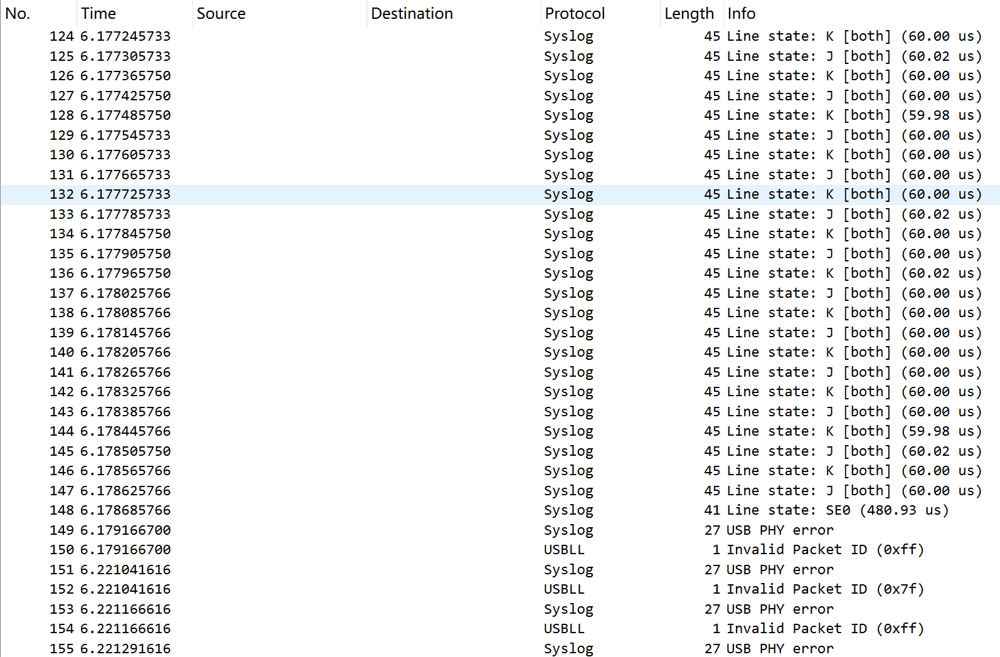

## 启动模式
### cypress默认
把vcc和boot两个测试点短接后，插入电脑，显示设备VID_04B4&PID_8613， 跑的是cypress默认rom里的程序。
此时电脑不认，要用zadig安装winusb驱动。
Vendor ID                : 0x04B4 (Cypress Semiconductor)
Product ID               : 0x8613
Manufacturer String      : ---
Product String           : ---
Serial                   : ---
USB Version              : 2.0

然后执行命令
.\software\usb_sniffer.exe --mcu-sram .\firmware\usb_sniffer.bin
执行成功后会renumerate成下面的设备

### ram启动
Vendor ID                : 0x6666 (Prototype - Non-commercial product (1))
Product ID               : 0x6620
Manufacturer String      : Alex Taradov
Product String           : USB Sniffer
Serial                   : [-----SN-----]
USB Version              : 2.1

执行命令：
.\software\usb_sniffer.exe --mcu-eeprom .\firmware\usb_sniffer.bin

### eeprom启动
EEPROM烧录成功后，断电重启或者短接RESET与GND，设备重新枚举。
Vendor ID                : 0x6666 (Prototype - Non-commercial product (1))
Product ID               : 0x6620
Manufacturer String      : Alex Taradov
Product String           : USB Sniffer
Serial                   : 44342594045a38
USB Version              : 2.1

## device只有一个in端点，如何接收主机out的固件更新数据？
原来是主机直接通过端点0写入，每次64字节。
void fx2lp_sram_upload(u8 *data, int size){
  #define USB_EP0_SIZE   64
  addr = 0;
  usb_fx2lp_reset(true);
  usb_fx2lp_sram_write(addr, data, sz);
}
void usb_fx2lp_reset(bool reset){
  rc = libusb_control_transfer(g_usb_handle,
    LIBUSB_ENDPOINT_OUT | LIBUSB_REQUEST_TYPE_VENDOR | LIBUSB_RECIPIENT_DEVICE,
    CMD_FX2LP_REQUEST, CPUCS_ADDR, 0/*wIndex*/, &reset, sizeof(reset), TIMEOUT);
}
void usb_fx2lp_sram_write(int addr, u8 *data, int size){
  rc = libusb_control_transfer(g_usb_handle,
    LIBUSB_ENDPOINT_OUT | LIBUSB_REQUEST_TYPE_VENDOR | LIBUSB_RECIPIENT_DEVICE,
    CMD_FX2LP_REQUEST, addr, 0/*wIndex*/, data, size, TIMEOUT);
}
software里的定义
enum
{
  CMD_FX2LP_REQUEST    = 0xa0,

  CMD_I2C_READ         = 0xb0,
  CMD_I2C_WRITE        = 0xb1,

  CMD_JTAG_ENABLE      = 0xc0,
  CMD_JTAG_REQUEST     = 0xc1,
  CMD_JTAG_RESPONSE    = 0xc2,

  CMD_CTRL             = 0xd0,
};
firmware里的定义
enum
{
  CMD_I2C_READ         = 0xb0,
  CMD_I2C_WRITE        = 0xb1,

  CMD_JTAG_ENABLE      = 0xc0,
  CMD_JTAG_REQUEST     = 0xc1,
  CMD_JTAG_RESPONSE    = 0xc2,

  CMD_CTRL             = 0xd0,
};
为何不公用一个定义？懂了，可能的原因是firmware里并不支持CMD_FX2LP_REQUEST，这个请求是blank_fx2lp固件支持的。

### 那为何不用端点0接收in数据？端点0应该也是可以收数据的吧？
REG(0xe740, EP0BUF[64]);      //EP0-IN/-OUT 缓冲区
REG(0xe780, EP1OUTBUF[64]);   //EP1-OUT 缓冲区
REG(0xe7c0, EP1INBUF[64]);    //EP1-IN 缓冲区

看来是fx2lp的端口0 IN/OUT共用一个缓冲区，所以主机输出用端口0， 主机接收用端口1。

## 抓包分析
### usb_jtag_enable(bool enable)
Setup Data
    bmRequestType: 0x40
        0... .... = Direction: Host-to-device
        .10. .... = Type: Vendor (0x2)
        ...0 0000 = Recipient: Device (0x00)
    bRequest: 192   //0xc0 CMD_JTAG_ENABLE
    wValue: 0x0001  //enable
    wIndex: 0 (0x0000)
    wLength: 0

对应设备端：
  if (USB_CMD(OUT, DEVICE, VENDOR) == bmRequestType && CMD_JTAG_ENABLE == bRequest){
    if (wValueL)
      jtag_enable();
    else
      jtag_disable();

static inline void jtag_enable(void){
  IFCONFIG = IFCONFIG_IFCLKSRC | IFCONFIG_IFCLKOE | IFCONFIG_IFCFG_PORTS;
  SYNCDELAY;
  JTAG_EN = 1;
}

## 测速--test和捕获capture都调用了usb_data_transfer，firmware如何区分两者？
void usb_data_transfer(void)
{
  for (int i = 0; i < TRANSFER_COUNT; i++)
  {
    int rc;

    g_buffers[i]   = os_alloc(TRANSFER_SIZE);
    g_transfers[i] = libusb_alloc_transfer(0);
    os_check(g_transfers[i], "libusb_alloc_transfer()");

    libusb_fill_bulk_transfer(g_transfers[i], g_usb_handle, DATA_ENDPOINT,
        g_buffers[i], TRANSFER_SIZE, usb_capture_callback, NULL, TRANSFER_TIMEOUT);

    rc = libusb_submit_transfer(g_transfers[i]);
    usb_check_error(rc, "libusb_submit_transfer()");
  }

  while (1)
  {
    libusb_handle_events(NULL);
  }
}

在usb_capture_callback回调中，是通过g_speed_test判断是测速还是捕获。

## 三种模式

Three modes are available in all package versions: Port, GPIF
 master, and Slave FIFO. These modes define the signals on the
 right edge of the diagram. The 8051 selects the interface mode
 using the IFCONFIG[1:0] register bits. Port mode is the power on
 default configuration. 
所有封装版本均支持三种模式：端口（Port）、GPIF主控（GPIF master）和从属FIFO（Slave FIFO）。
这些模式决定了示意图右侧边缘的信号定义。
8051通过IFCONFIG[1:0]寄存器位选择接口模式，其中端口模式为上电默认配置。

### 1. 端口模式（Port Mode）
原理：

默认上电模式，作为USB接口与本地端点FIFO的桥梁
USB数据通过端点缓冲区（EPx）与内部FIFO交互
支持批量/中断/同步传输类型，自动处理USB协议栈

通过EPxCFG寄存器配置端点类型/大小
使用EPxBUF设置缓冲区地址
自动枚举为默认USB设备类（可通过VID/PID自定义）

### 2. GPIF主控模式（GPIF Master Mode）
GPIF: General Programmable Interface  通用可编程接口
原理：

用户可编程状态机生成自定义波形
通过波形描述符（GPIF TCB）控制时序
支持8/16位数据总线，可驱动外部存储器/LCD等

连接USB总线与复杂并行外设

### 3. 从属FIFO模式（Slave FIFO Mode）
原理：

外部主控（FPGA/CPU）直接访问内部FIFO
支持同步（IFCLK）或异步接口
通过外部控制信号（SLWR/SLRD）管理读写指针

关键配置：

通过IFCONFIG选择Slave FIFO模式
配置EPxFIFOCFG设置FIFO行为
外部主控需生成SLCS/SLWR/SLRD控制信号
同步模式下需连接IFCLK时钟源

## Table 12.  FX2LP Register Summary

## CY7C68013A/CY7C68014A  56 引脚 SSOP

## 肖特基二极管BAT54S
为什么IO_IN接到了肖特基二极管BAT54S的中间。
IO_IN也就是PA1/INT1#引脚。

## 如何监听high speed设备的通信，比如U盘
似乎不支持high speed设备？比如一个2.0的高速U盘，抓包如下：

## 测速代码
修改software/os_common.c
 u16 os_rand16(u16 seed)
 {
-  static u16 state = 0x6c41;
+  static u16 state = 0x6c51;
和fpga/usb_sniffer.v
 always @(posedge ifclk_i) begin
   if (!test_sync_w)
-    rng_r <= rng_next(16'h6c41);
+    rng_r <= rng_next(16'h6c51);

运行下面的代码可以看到效果
make -C .\software
.\software\usb_sniffer.exe --fpga-sram .\fpga\impl\usb_sniffer_impl.bit
.\software\usb_sniffer.exe --test
或者
.\software\usb_sniffer.exe --fpga-flash .\fpga\impl\usb_sniffer_impl.jed

