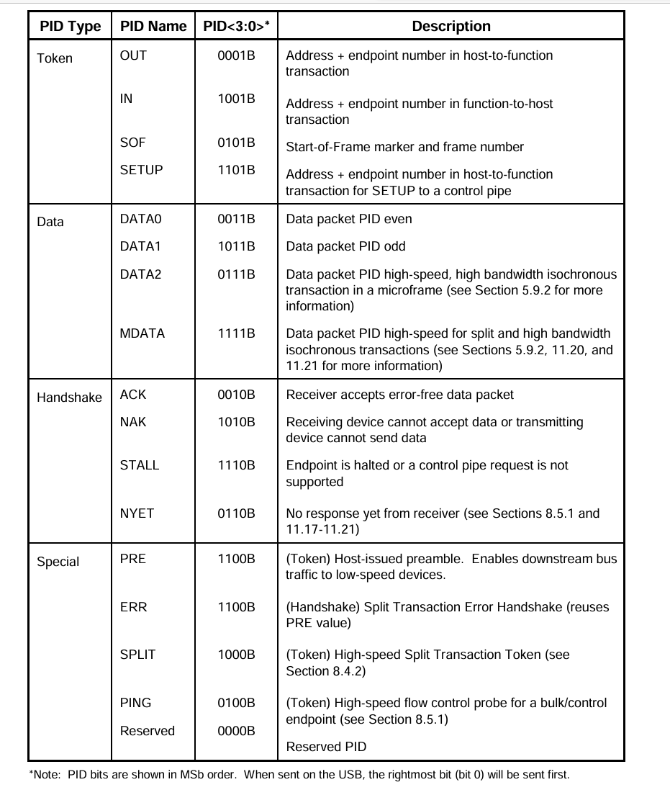

为什么上面的代码里，
#define DATA_HEADER_SIZE               7
#define STATUS_HEADER_SIZE             4
能否判断出status_header/data_header每字节的含义？

根据补充的宏定义，我们可以更精确地重建 **STATUS_HEADER** 和 **DATA_HEADER** 的结构。以下是逐字节的详细解析：

---

### **STATUS_HEADER (4字节)**
| 字节 | 位域   | 宏定义                  | 说明                                                                 |
|------|--------|-------------------------|----------------------------------------------------------------------|
| **0** | **7**  | `HEADER_STATUS (0x80)`  | **状态头标识**：置1表示这是状态头                                    |
|      | **6**  | `HEADER_TOGGLE (0x40)`  | **数据包切换位**（USB的DATA0/DATA1交替）                             |
|      | **5**  | `HEADER_ZERO (0x20)`    | **零标志**：可能表示零长度包                                         |
|      | **4**  | `HEADER_TS_OVERFLOW (0x10)` | **时间戳溢出标志**                                                 |
|      | **3-0**| -                       | **时间戳高4位**（`ts[18:15]`）                                      |
| **1** | **7-0**| -                       | **时间戳中8位**（`ts[14:7]`）                                       |
| **2** | **7-0**| -                       | **时间戳低8位**（`ts[6:0]`）                                        |
| **3** | **7-6**| `HEADER_SPEED`          | **速度模式**： `0b00`=低速(Low Speed), `0b01`=全速(Full Speed), `0b10`=高速(High Speed) |
|      | **5**  | `HEADER_TRIGGER (0x20)` | **触发标志**：外部触发事件（如分析仪手动触发）                       |
|      | **4**  | `HEADER_VBUS (0x10)`    | **VBUS状态**：1=VBUS供电有效                                         |
|      | **3-0**| `HEADER_LS_MASK (0x0f)` | **线路状态**： 编码USB物理层状态（如 `SE0`、`J`、`K` 状态）       |

从下面的代码可知，LS（line_state）里低2位是dp，高2位是dm。
  int dp = (capture_saved_ls >> 0) & 3;
  int dm = (capture_saved_ls >> 2) & 3;

---

### **DATA_HEADER (7字节)**
| 字节 | 位域   | 宏定义                  | 说明                                                                 |
|------|--------|-------------------------|----------------------------------------------------------------------|
| **0** | **7**  | `HEADER_STATUS (0x80)`  | **数据头标识**：0表示这是数据头（与状态头相反）                      |
|      | **6**  | `HEADER_TOGGLE (0x40)`  | **数据包切换位**（同状态头）                                         |
|      | **5**  | `HEADER_ZERO (0x20)`    | **零标志**：可能表示零长度数据包                                     |
|      | **4**  | `HEADER_TS_OVERFLOW (0x10)` | **时间戳溢出**（同状态头）                                          |
|      | **3-0**| -                       | **时间戳高4位**（`ts[18:15]`）                                      |
| **1** | **7-0**| -                       | **时间戳中8位**（`ts[14:7]`）                                       |
| **2** | **7-0**| -                       | **时间戳低8位**（`ts[6:0]`）                                        |
| **3** | **7**  | -                       | 保留（未使用）                                                      |
|      | **6**  | -                       | 保留（未使用）                                                      |
|      | **5**  | `HEADER_DATA_ERROR (0x20)` | **数据错误**：如位填充错误等                                        |
|      | **4**  | `HEADER_CRC_ERROR (0x10)` | **CRC错误**：校验失败                                               |
|      | **3**  | `HEADER_OVERFLOW (0x08)` | **缓冲区溢出**：捕获缓冲区不足                                       |
|      | **2-0**| -                       | **数据长度高3位**（`size[10:8]`）                                   |
| **4** | **7-0**| -                       | **数据长度低8位**（`size[7:0]`），总长度= `(byte3[2:0] << 8) | byte4` |
| **5** | **7-0**| -                       | **传输持续时间高8位**（单位可能是时钟周期）                          |
| **6** | **7-0**| -                       | **传输持续时间低8位**                                               |

---

### **关键差异总结**
| 字段               | STATUS_HEADER                  | DATA_HEADER                     |
|--------------------|--------------------------------|---------------------------------|
| **HEADER_STATUS**  | 1（标识状态头）                | 0（标识数据头）                 |
| **Byte 3**         | 线路状态、VBUS、触发标志       | 错误标志（溢出/CRC/数据错误）   |
| **长度字段**       | 无                             | Byte3[2:0] + Byte4 组成11位长度 |
| **扩展字段**       | 无                             | 传输持续时间（Byte5-6）         |

---

### **典型场景示例**
1. **状态头**  
   - 捕获USB总线状态变化（如VBUS断开、设备复位）。
   - 示例值：`0xBF 0x12 0x34 0x31`  
     - `0xBF`：状态头+切换位+时间戳高4位=0x0F  
     - 时间戳= `0x0F1234`  
     - `0x31`：线路状态=0x1，VBUS=1，触发=0  

2. **数据头**  
   - 捕获USB数据包（如IN/OUT事务）。  
   - 示例值：`0x2F 0x56 0x78 0x25 0x80 0x01 0x00`  
     - `0x2F`：数据头+时间戳高4位=0x0F  
     - 时间戳= `0x0F5678`  
     - `0x25`：数据错误=1，长度= `0x5 << 8 | 0x80 = 0x0580`  
     - 持续时间= `0x0100` 时钟周期  

这种设计高效紧凑，适合实时USB协议分析，尤其注重错误检测和时间戳精度。

## Line State
  int dp = (capture_saved_ls >> 0) & 3;
  int dm = (capture_saved_ls >> 2) & 3;
  else if (dp == 0)
  {
    strcat(str, (CaptureSpeed_LS == g_opt.capture_speed) ? "J" : "K");
    level = dm;
  }
  else if (dm == 0)
  {
    strcat(str, (CaptureSpeed_LS == g_opt.capture_speed) ? "K" : "J");
    level = dp;
  }
  else
  {
    char buf[64];
    snprintf(buf, sizeof(buf), "Undefined (DP=%d / DM=%d)", dp, dm);
    strcat(str, buf);
  }

  if (level == 1)
    strcat(str, " [both]");
  else if (level == 2)
    strcat(str, " [single]");

dp/dm都是两位，然后level是否代表电压水平？

实际含义（推测）：
level=1：弱上拉（如 USB 设备未连接时的 D+ 上拉）
level=2：强上拉（如主机控制器驱动）

## PACKET PID
USB协议里的PID字段定义，是从0位开始到最高位。发送时先发送最高位MSB。比如规范里定义OUT=0001B，则0、1、2、3位分别是1\0\0\0。然后4-7位分别是0-3位的补码，也就是0、1、1、1，所以从MSB开始发送的数据是1110 0001 = 0xe1。请按照这个规则，计算图中所有的PID值。

根据规则计算所有PID值如下：

| PID Type | PID Name    | PID<3:0> | 补码（高4位） | 完整PID（二进制） | 十六进制 |
|----------|-------------|----------|----------------|-------------------|----------|
| Token    | OUT         | 0001B    | 1110B          | 11100001          | 0xE1     |
|          | IN          | 1001B    | 0110B          | 01101001          | 0x69     |
|          | SOF         | 0101B    | 1010B          | 10100101          | 0xA5     |
|          | SETUP       | 1101B    | 0010B          | 00101101          | 0x2D     |
| Data     | DATA0       | 0011B    | 1100B          | 11000011          | 0xC3     |
|          | DATA1       | 1011B    | 0100B          | 01001011          | 0x4B     |
|          | DATA2       | 0111B    | 1000B          | 10000111          | 0x87     |
|          | MDATA       | 1111B    | 0000B          | 00001111          | 0x0F     |
| Handshake| ACK         | 0010B    | 1101B          | 11010010          | 0xD2     |
|          | NAK         | 1010B    | 0101B          | 01011010          | 0x5A     |
|          | STALL       | 1110B    | 0001B          | 00011110          | 0x1E     |
|          | NYET        | 0110B    | 1001B          | 10010110          | 0x96     |
| Special  | PRE         | 1100B    | 0011B          | 00111100          | 0x3C     |
|          | ERR         | 1100B    | 0011B          | 00111100          | 0x3C     |
|          | SPLIT       | 1000B    | 0111B          | 01111000          | 0x78     |
|          | PING        | 0100B    | 1011B          | 10110100          | 0xB4     |
|          | Reserved    | 0000B    | 1111B          | 11110000          | 0xF0     |

**说明：**  
1. **补码计算规则**：将PID<3:0>的每一位取反，得到高4位。  
2. **完整PID**：补码（高4位） + PID<3:0>（低4位），按MSB顺序组合。  
3. **特殊说明**：  
   - PRE（Token）和ERR（Handshake）的PID值相同（0x3C），但通过上下文区分类型。  
   - Reserved的PID值为0xF0，不可使用。